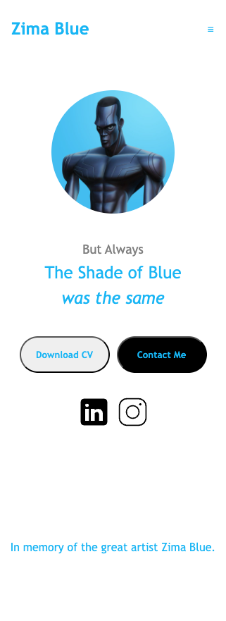

The L project is a self made challenge, to test my skills in front-end since I've been working as backend developer for 6 years now, I'll be posting all the projects coded in the daily bases until I finish 50 of them

# 1 - Send Landing Page

2 - Simple portfolio page

